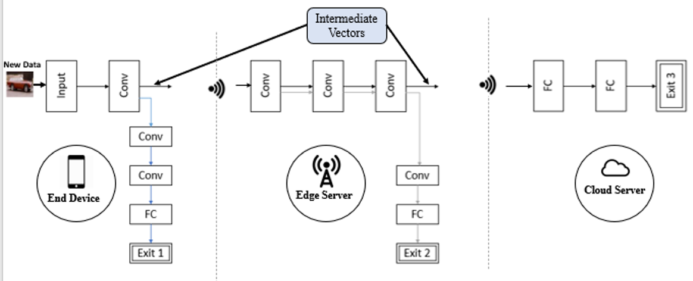
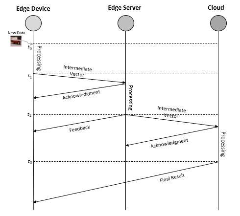
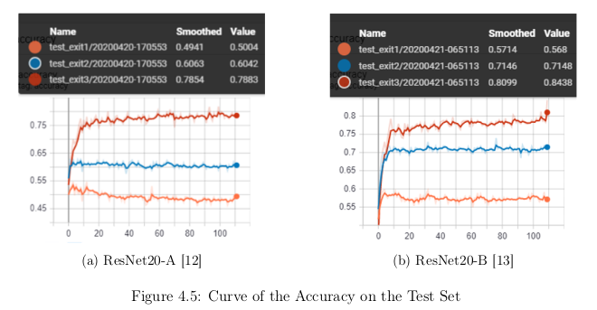
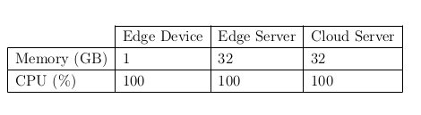
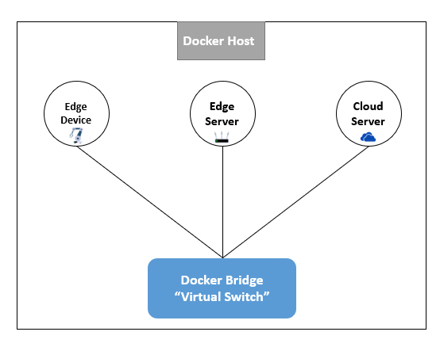
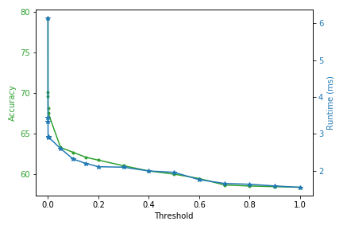

# Edge-Computing

> ## Introduction
>* Deep neural networks are the state of the art methods for many learning tasks thanks to their potential to derive better features at each network layer. However, the increased efficiency of additional layers in a deep neural network comes at the cost of additional latency and energy consumption in feed forward inference. Thus, it becomes more challenging to deploy them in the edge with limited resources.
Therefore, large-scale DL models are generally deployed in the cloud while end devices merely send input data to the cloud and then wait for the DL inference results. Specifically, it cannot guarantee the delay requirement for real-time services such as real-time object recognition with strict demands.
To address these issues, DL applications tend to resort to edge computing. In fact, the use of optimization techniques, distributed DNNs and collaborative inference between IoT devices and the cloud becomes a promising solution.

> ## Proposed Work:
>### 1. Proposed Architecture
>In order to reduce the computation time of DL inference, we add early exits branches at
different stages of the network. Hence, this latter enable the inference to exit early from these
additional branches based on a confidence criteria. For instance, as depicted in figure below, an
edge device could give primary inference results at an early stage if the confidence criteria is
satisfied. Otherwise, further computation should take place on the cloud or on the edge server.

>### 2. Distributed Model Inference
>During inference, the predictions will be made by the earlier exits until the main branch (last exit point) is reached. As a result, the forecast will be returned by the last exit in the worst case. To deal with the communication between different nodes, we employ a distributed workflow to take charge of the message activity and the synchronization as depicted in figure below:

> ## Simulation and Results:
>### 1. Training and Evaluation of the distributed CNN model:
>The training process was done on Google Colab platform using free access GPU card "Tesla T4". Indeed, this latter performs inference of ResNet50 model 27 times more faster than CPU. As a result, training of each DL model took about 1 hour and 18 minutes which is considerably fast.

>### 2. Distributed Inference Implementation:
>In fact, we have implemented the scenario using "Docker" open source platform to containerize the applications on virtual nodes. Thanks to this latter, we could create containers that process application packaging to deliver edge computing applications to the network.
Indeed, a container is a running process that embodies additional functionalities to keep it separated from the host and the rest of containers. In addition, Docker provide ways to control the runtime options i.e. Memory, CPU. As a result of that, we have built three containers that represents the EC environment and we have set the runtime options as shown in table below:

>Docker provides a powerful feature that enables the connection between different containers using a specific network. In our case, we have used the bridge network provided by Docker as depicted in figure 4.6. The latter uses a software bridge network, which is a link layer that
dispatch traffic between network segments, in order to enable communication between different Docker containers. Thus, we have used ZeroMQ [17] to pass messages and synchronizations between different Docker containers using the bridge network channels. In fact, ZeroMQ is an
asynchronous messaging library that focuses on developing distributed and concurrent applications. Furthermore, we have used TCP transport layer for data transmission.

>### 3. Performance Analysis of the distributed Inference:
>We deploy the distributed inference of ResNet20-B model using Docker to evaluate the performance of EEoI model. Since the entropy threshold T directly affects on the model performance, as well as on the exit point that will perform the inference, we evaluate the performance of
ResNet20-B under different threshold values.
The figure below depicts the influence of the entropy threshold on both the accuracy (i.e. model performance) and the inference runtime. In fact, we can see that both of the accuracy and the runtime become lower as the entropy threshold increases. Meaning that the higher threshold
leads to a decreasing in the inference time while the accuracy is deteriorating.

